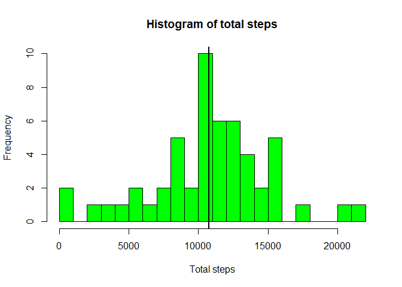
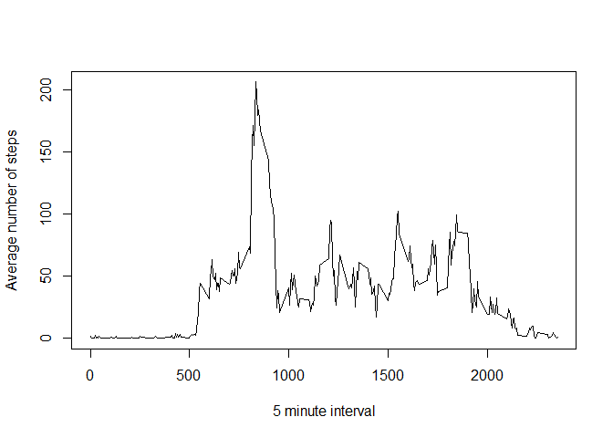
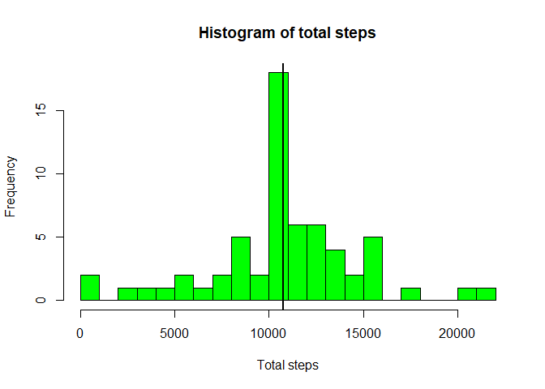
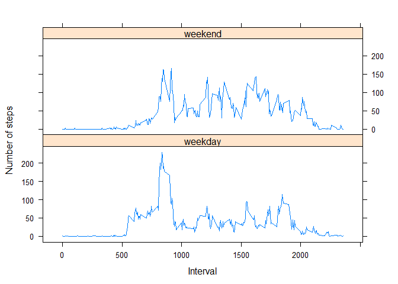

This is a report for the assignment Course Project 1 for the course Reproducible Research

The assignment makes use of data from a personal activity monitoring device. This device collects data at 5 minute intervals through out the day. The data consists of two months of data from an anonymous individual collected during the months of October and November, 2012 and include the number of steps taken in 5 minute intervals each day.

## Loading and preprocessing the data

With the code below I open the data and inspect the dataset to evaluate whether the raw data needs to be processed


```r
directory <- getwd()
file <- "repdata_data_activity/activity.csv"
path_file <- paste(directory,file,sep="/")
data <- read.csv(path_file)
str(data)
```

```
## 'data.frame':	17568 obs. of  3 variables:
##  $ steps   : int  NA NA NA NA NA NA NA NA NA NA ...
##  $ date    : chr  "2012-10-01" "2012-10-01" "2012-10-01" "2012-10-01" ...
##  $ interval: int  0 5 10 15 20 25 30 35 40 45 ...
```

The variables included in this dataset are:

steps: Number of steps taking in a 5-minute interval
date: The date on which the measurement was taken in YYYY-MM-DD format
interval: Identifier for the 5-minute interval in which measurement was taken

The variable data has class character and I convert it to POSIXct format to be able to explore all functionalities. 
The following code convert the format of the date variable


```r
#Convert date in POSIXct
data$date <- as.Date(data$date)
```
## What is the mean total number of steps taken per day?

First I calculate the total number of steps taken per day and store it in the variable tot_steps which is then converted to a dataframe with two columns: tot_steps and date


```r
tot_steps <- tapply(data$steps,data$date,sum)
totsteps <- data.frame(date=names(tot_steps),total=tot_steps)
```

Second I make a histogram of the total number of steps taken each day and include a vertical line which represents the mean


```r
hist(totsteps$total, breaks=20, col="green",xlab="Total steps",main="Histogram of total steps")
abline(v=mean(totsteps$total,na.rm=TRUE),lwd=2)
```

<!-- -->

Third I calculate and report the mean and median of the total number of steps taken per day


```r
mean <- mean(totsteps$total,na.rm=TRUE)
median <- median(totsteps$total,na.rm=TRUE)
```

The mean is

```
## [1] 10766.19
```

The median is


```
## [1] 10765
```

## What is the average daily activity pattern?

The following code make a time series plot of the 5-minute interval and the average number of steps taken, averaged across all days, to show how many steps are taken during the day on average over the period of time


```r
#Calculate mean over days for each 5-minute interval
#First need to split datasets by interval and take the average for that interval over all days
mean_steps_interval <- tapply(data$steps,data$interval,mean,na.rm=TRUE)
meansteps_interval <- data.frame(interval=names(mean_steps_interval),mean=mean_steps_interval)
meansteps_interval$interval <- as.integer(meansteps_interval$interval) 

#Time series plot
plot(meansteps_interval$interval,meansteps_interval$mean, type = "l",
     ylab = "Average number of steps", xlab = "5 minute interval")
```

<!-- -->

Which 5-minute interval, on average across all the days in the dataset, contains the maximum number of steps?


```r
max <- max(meansteps_interval$mean)
max_interval <- meansteps_interval$interval[meansteps_interval$mean==max]
```

The 5-minute interval which contains the maximum number of steps on average is `max_interval`


```
## [1] 835
```

## Imputing missing values
I calculate the total number of missing values in the dataset with the code below


```r
missing_steps <- sum(is.na(data$steps))
```

The total number of missing values is


```
## [1] 2304
```

I replace the missing value for each time step using the mean over all days for each time step 


```r
#Use the mean/median for the 5-minute interval over days to input missing values
data1 <- data

for (i in 1:nrow(data)) {
  if (is.na(data$steps[i])) {
    interval <- data$interval[i]
    data1$steps[i] <- meansteps_interval$mean[meansteps_interval$interval==interval]
  }
}

#Check that the new datasets does not have missing values
missing_steps1 <- sum(is.na(data1$steps))
```

I examine again the total number of steps taken per day now that I input missing values


```r
tot_steps1 <- tapply(data1$steps,data1$date,sum)
totsteps1 <- data.frame(date=names(tot_steps1),total=tot_steps1)
```

I plot a histogram of the total number of steps taken each day without missing values


```r
hist(totsteps1$total, breaks=20, col="green",xlab="Total steps",main="Histogram of total steps")
abline(v=mean(totsteps1$total,na.rm=TRUE),lwd=2)
```

<!-- -->

Looking at this new histogram it seems that the data are less spread and more concentrated around the mean

I calculate and report the mean and median of the total number of steps taken per day for the dataset with no missing values


```r
mean1 <- mean(totsteps1$total,na.rm=TRUE)
median1 <- median(totsteps1$total,na.rm=TRUE)
```

The mean and the median of the total daily steps taken are


```r
mean1
```

```
## [1] 10766.19
```

```r
median1
```

```
## [1] 10766.19
```

More or less similar to the meand and median of the data before inputting missing values


```r
mean
```

```
## [1] 10766.19
```

```r
median
```

```
## [1] 10765
```

## Are there differences in activity patterns between weekdays and weekends?

I created a new variable factor to identify whether the data refer to weekdays or weekend


```r
#Create a new variable with weekdays
data1$days <- weekdays(data1$date)
#Make the factor variable
data1$weekvswe[data1$days=="Monday"|data1$days=="Tuesday"|data1$days=="Wednesday"|
                 data1$days=="Thursday"|data1$days=="Friday"] <- "weekday"
data1$weekvswe[data1$days=="Saturday"|data1$days=="Sunday"] <- "weekend"
```

Create the means to be plotted and then merge all in one dataset


```r
#Calculate the average number of steps taken, averaged across all weekdays or weekend days
data1_weekdays <- subset(data1,weekvswe=="weekday")
data1_weekend <- subset(data1,weekvswe=="weekend")

mean_steps_interval_weekdays <- tapply(data1_weekdays$steps,data1_weekdays$interval,mean,na.rm=TRUE)
meansteps_interval_weekdays <- data.frame(interval=names(mean_steps_interval_weekdays),mean=mean_steps_interval_weekdays)
meansteps_interval_weekdays$interval <- as.integer(meansteps_interval_weekdays$interval) 
meansteps_interval_weekdays$mean <- as.integer(meansteps_interval_weekdays$mean) 
meansteps_interval_weekdays$weekvswe <- "weekday" 

mean_steps_interval_weekend <- tapply(data1_weekend$steps,data1_weekend$interval,mean,na.rm=TRUE)
meansteps_interval_weekend <- data.frame(interval=names(mean_steps_interval_weekend),mean=mean_steps_interval_weekend)
meansteps_interval_weekend$interval <- as.integer(meansteps_interval_weekend$interval) 
meansteps_interval_weekend$mean <- as.integer(meansteps_interval_weekend$mean)
meansteps_interval_weekend$weekvswe <- "weekend" 

#Create table with means and a factor variable indicating whether is weekend or weekdays
meansteps_weekvswe <- rbind(meansteps_interval_weekdays,meansteps_interval_weekend)
meansteps_weekvswe$weekvswe <- as.factor(meansteps_weekvswe$weekvswe)
```

The following code make a panel plot containing a time series plot of the 5-minute interval (x-axis) and the average number of steps taken, averaged across all weekday days or weekend days (y-axis) using the lattice package


```r
library(lattice)
xyplot(mean ~ interval | weekvswe,data=meansteps_weekvswe, type = "l",
       ylab = "Number of steps", xlab = "Interval",layout=c(1,2))
```

<!-- -->

